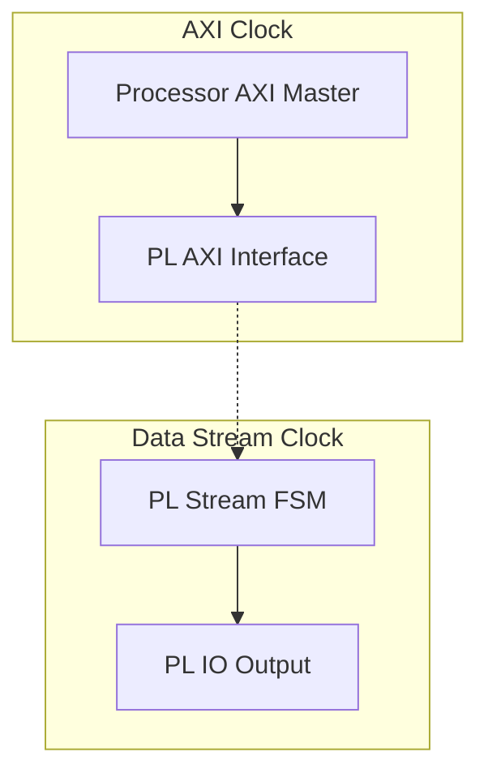
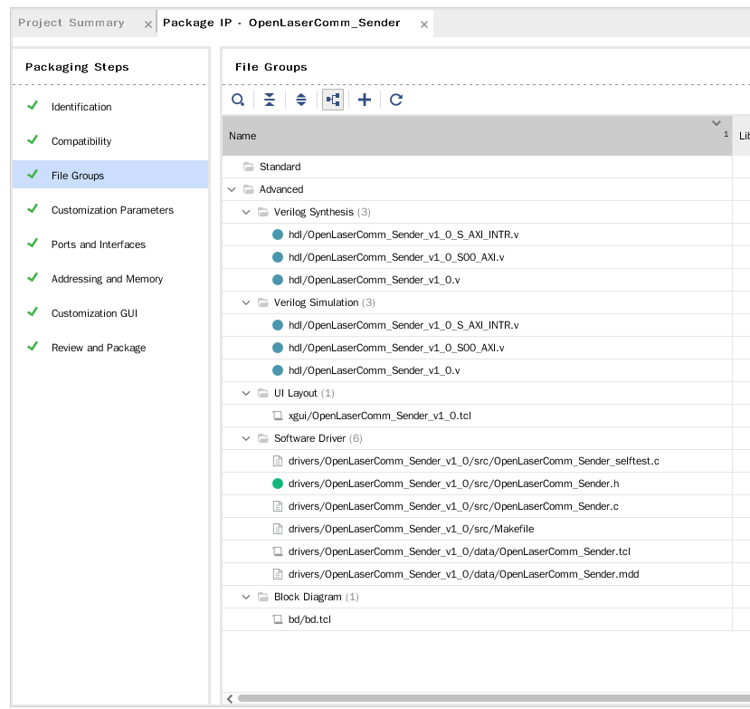
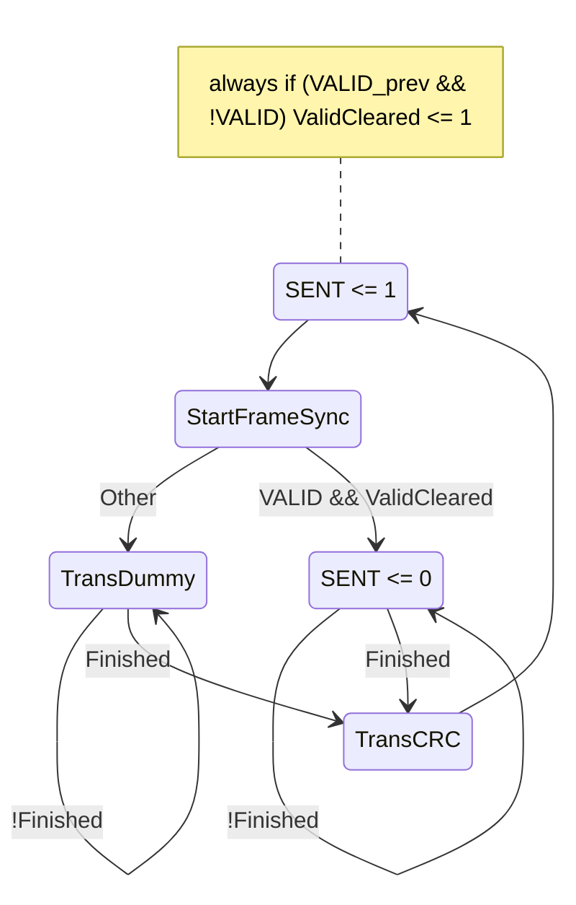

# OpenLaserComm Design

## Sender Side (PL & PS)

### Overview

1. Pack data to frames
   - Frame Length: ~1500 Byte, or larger
2. Deliver frames to Zybo PL
   - (**CURRENT**) Basic Ver: CPU -> PS AXI Master Port -> PL Framebuffer & Driver (in AXI interface)
   - (**PLANNING**) Basic Ver with FIFO:
     - Ping-Pong Buffer? Seems complicated..
   - (**PLANNING**) Adv. Ver:
     - Init. Transfer: CPU -> PS AXI Master Port -> PL AXI CDMA
     - CDMA moves frame from CPU to PL Framebuffer
       - (CPU can free during this phase)
     - Interrupt CPU when completed
3. PL sends Frame Synchronization Sequence
   - Medium-lengthed, and separable from 8b/10b encoding
4. PL sends Frame Content with 8b/10b encoding
5. PL ends transfer with CRC Code

### Clock

The whole things is about "Reading Frames" & convert them to stream (to be carried on wire / lasers).

Stream clock is fixed & probably won't match the AXI clock.

So whole design separates into two (in basic version):

The behaviour of PL Stream FSM is as follows:

1. In the beginning of each frame (this is held by its internal counter), detect if there is data ready to be sent in the memory.
   - If so, send it, and mark the data as "sent"
   - If not, send dummy frame, without modification to "sent" signal
2. Repeat Step 1

So, a "VALID" and a "SENT" signal are required to cross AXI Clock and Data Stream Clock. They will be treated with one FF per side, to avoid potential error caused by multiple clock domains. Also, a Dual Port RAM, with asynchronous read functionality may seems necessary.

### Frames

Frames are of fixed-size, and dummy frames are sent when frames are idle. 

PL sends frame `[Frame Sync.] + encode([00000001] [01010101]... [CRC32 Byte0] [CRC32 Byte1])`  as dummy frames, so the first byte in a frame can be used as frame type byte.

### PL AXI Interface

Writing AXI Slave FSM is error prone, and Vivado have provided `Peripheral IP` to wrap registers directly into AXI usable memory-mapped addresses. Details can be seen on *Chapter 7: Creating Custom IP and Device Driver for Linux*, [Zynq-7000 All Programmable SoC: Embedded Design Tutorial (UG1165)](https://www.xilinx.com/support/documentation/sw_manuals/xilinx2019_1/ug1165-zynq-embedded-design-tutorial.pdf).

#### Implementation Notice

> These notices serves as a remainder for developers.
>
> TODO: Merge into a engineering notebook or something

Vivado will provide a separate (sub)project for the AXI4 Peripheral IP generated using **Tools -> Create And Package New IP**. Templates include from Verilog sources to Kernel Drivers.(todo: check this ?)

In `hdl/OpenLaserComm_Sender_v1_0_S00_AXI.v`, there is RAM generated according to USER_NUM_MEM, and user logic left for implementation. 

#### Memory Map

| Relative Address                     | Description                    |
| ------------------------------------ | ------------------------------ |
| 0000_0000                            | Data Transfer Control Register |
| 0000_0010 ~ 0000_0010 + Frame Length | Frame Content Area             |

#### Data Transfer Control Register

Bit 0: Data Valid Bit

- Indicate the data in *Frame Content Area* is valid.

  CPU writes "Frame Content Area" => CPU writes "Data Valid Bit" to 1 => Data FSM Sends the data, setting "Data Valid Bit" to 0 (and triggers an Interrupt) => CPU detects this and initiate next transfer.

#### Frame Content Area

N/A

#### DEBUG INFO

由于 Create and Package New IP 中的 AXI Full 只支持 Memory Size 1024Byte (Max)，所以就先让 Frame Length = 1024 -16 = 1008，这样 0000_0010 ~ 0000_0400 就是 Frame Content Area 了。

（好像也可以搞得更大，不过我们先不管了为好）

### Data Stream FSM

Data Stream held responsible for sending the data on frame to the wire.

Its FSM is as follow:

CRC is rolling, and can be easily attached. TransData & TransDummy shall handle 8b/10b encoding.

> 可以先咕咕.jpg

## Receiver Side (PL & PS)

### Overview

Receiver side shall do the following:

1. When synchronized ("IN_SYNC"), decode & check CRC, pass frames to upper layer if CRC is correct.

2. When signs of losing synchronization happen:

   - Too many bad CRCs in cumulative time window
   - Wrong Frame Sync Signal

   Goto "SYNCING" mode

3. In "SYNCING" mode, actively looking for Frame Sync Bits. When met, turn to "IN_SYNC".

Receiver upper layer communication scheme:

- Basic Ver: TODO