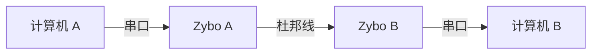
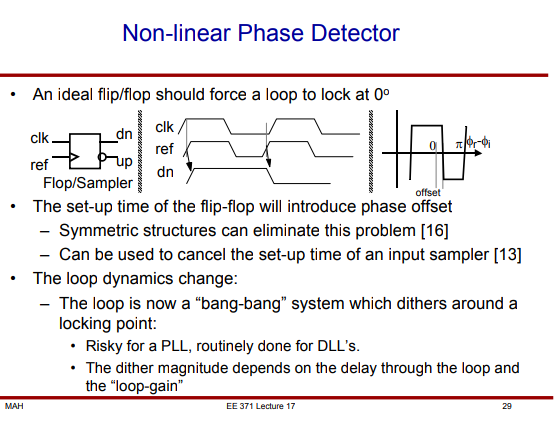
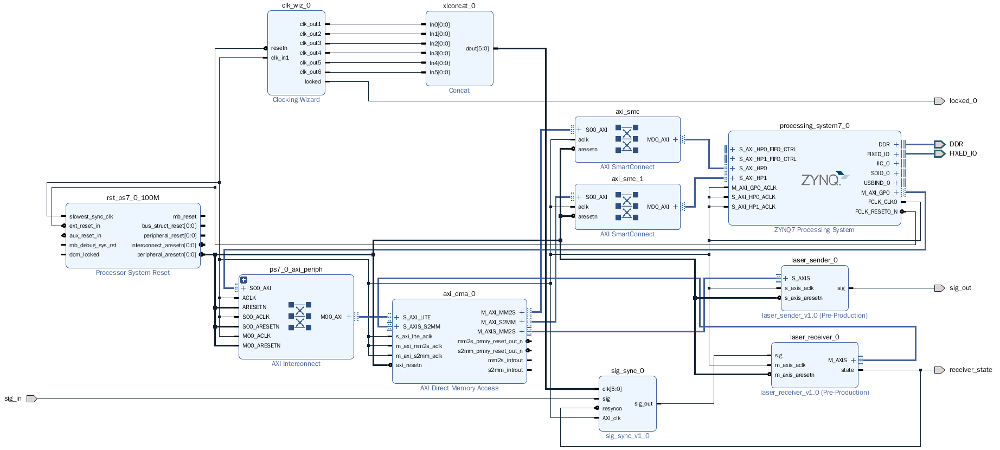
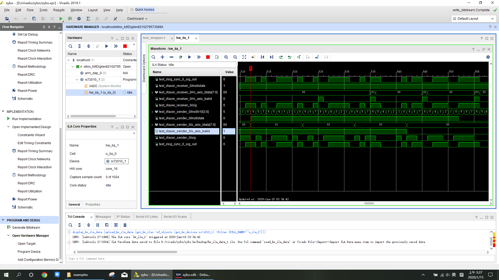
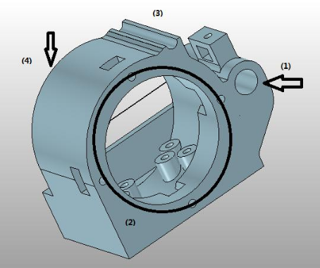
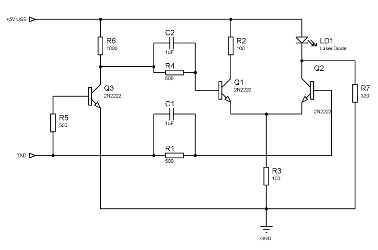

# 嵌入式系统设计方法 大作业 报告

## 小组成员

刘紫檀

王铭剑

## 演示

接线如下：


演示视频：

- 链接：https://rec.ustc.edu.cn/share/9a629020-37d3-11ea-99bb-416aaa8fb258 密码：ufss

源码：

- 链接：https://rec.ustc.edu.cn/share/ef745f60-37d3-11ea-916a-cb6c0977c2d1
  - 一个压缩包是我们写的三个 IP 核，另一个是主工程和 SDK 内的软件代码
- 之后会在 https://github.com/libreliu/OpenLaserComm 进行开源

## 详细介绍

我们的大作业的目标是「在 Zybo 上实现高速大气激光通信」。由于工期限制，截至提交时，只完成到了「Zybo 高速杜邦线通信」的水平。

该设计的结构如下所示：



（数据流在设计上是双工的，即每个 Zybo 上都有一套完整的收发电路）

### 背景知识

为了避免造成理解上的困难，下面对相关概念进行一个简要的介绍。

1. Xilinx 公司的文档都有一个对应的编号（Eg. UG821, Zynq-7000 的软件开发指南），利用对应的编号可以很轻松的获取对应文档，所以下文不再赘述格式为「UG XXX」的 Xilinx 的文档链接。

2. Digilent Zybo 开发板（下面简称 Zybo）的核心是一块 Zynq-7000 系列 SoC（具体的说，是 `XC7Z010-1CLG400C`）。该 SoC 将两个 Cortex-A9 核心（PS，Processing System）和可编程逻辑（PL，Programmable Logic）结合在一起，很适合那些需要硬件加速的设计。PS 和 PL 之间通信需要靠 AXI HP/GP 总线（或者 EMIO，相当于把属于 PS 的外设的某些输入引脚设为从 PL 引入）。

   更多关于 Zybo 和 Zynq 的信息可以在如下地址获得：

   - [Zybo Reference Manual](https://reference.digilentinc.com/reference/programmable-logic/zybo/reference-manual)
   - UG585, Zynq-7000 SoC Technical Reference Manual

   关于在 Vivado 中进行带微处理器的设计，可以参见 UG940, Vivado Design Suite Tutorial
   Embedded Processor Hardware Design

3. AXI（Advanced eXtensible Interface）总线是一类并行高速总线的统称。最新的 AXI 标准中，有 AXI4-Lite（简单版本的 AXI4），AXI4（最复杂，面向 MMIO 外设设备），AXI4-Stream（面向流设备，此种设备不需要地址线，只需要确认机制 `ready` `valid` 和帧结束信号 `tlast`）；在所有种类的总线中，主设备在准备好要交给从设备的数据后抬高 `valid` 引脚，保持数据直到从设备在接收后抬高 `ready`引脚。

   更多关于 AXI 总线的信息可以参阅维基百科和 ARM AMBA（ Advanced Microcontroller Bus Architecture）的文档。

4. 在大气激光通信中，信道有个显著的特性：有很多低频干扰（比如 50 Hz 的日光灯）

   为了解决低频干扰的问题，需要对输入信号进行滤波。一个暴力的方案是，将激光器的亮度进行调制，并且在接收端进行 `new_sig = sig - avg(sig)` 的处理。这就需要激光器的亮度相对均匀，即信号的「直流偏置」基本保持稳定。

   接收端在接收信号时，因为接收端的时钟和发射端的相位可能存在区别（肯定会..），接收端需要选择一个最优的时钟用来进行信号的判决。此过程称为「时钟恢复（Clock Data Recovery）」。我们通过在 PL 中生成六个时钟，并且利用触发器作为一种「非线性的鉴相器」来判断哪个时钟最优。当后续的 8b/10b 解码遇到错误的码字时，时钟恢复模块（*sig_sync*）会尝试根据鉴相器的结果重新选择一个时钟。

   在时钟恢复后，接收端需要决定哪些比特归属于同一个字节，此过程称为「群同步」。我们通过检测 K.28.1 来实现群同步。

   相关内容可以参考如下资源：

   - 各种《通信原理》教科书（位同步，群同步...）

   - [Stanford EE371 课程课件 - 第 17 讲 时钟数据恢复](https://web.stanford.edu/class/archive/ee/ee371/ee371.1066/lectures/Old/Older/lect_17_CDR_2up.pdf)（PLL，DLL，鉴相器实现；本实验中我们就采用了它的基于触发器的鉴相器的思路）

     

5. 8b/10b 编码是一种线路编码，其将每个字节插入两个比特变成 10 bit，用来提供直流平衡和合理的时钟恢复性能。其将数据拆为 5b 和 3b 两个部分，分别映射为 6b 和 4b 两个部分，并且根据当前 1 比 0 多的个数（Running Disparity，RD）来选择对应的 6b （然后计算 RD 改变，然后选择对应的 4b）。在编码中有一些码专门为控制目的预留（控制码），其中又有一些码在任意数据码组成的滑动窗口中均不会出现（比如我们采用的 **K.28.1**），可以用来进行群同步。更多关于此编码的资料请参考维基百科。

### 数据流

```
一台电脑的串口终端 ==(UART)==> [PS,1] UART 模块 ==(通过轮询接收)==> [PS,1] ARM 核中运行的事件主循环程序 ==(发起DMA请求并且等待请求完成)==> [PL,1] AXI DMA 模块 ==(Memory to Stream: AXI4-Stream)==> [PL,1] laser_sender 模块 ==(经过上一个模块后，数据被编码为 8b/10b 并且插入了很多 K.28.1 用于群同步；信号经过开发板的 PMOD Header 和杜邦线进入另一块板子的 PMOD Header)==> [PL,2] sig_sync 模块 ==(时钟恢复完毕的信号)==> [PL,2] laser_receiver 模块 ==(恢复好的字节数据, AXI4-Stream 协议)==> [PL,2] AXI DMA 模块 ==> [PS,2] ARM 核中运行的事件主循环程序 ==> [PS,2] UART 模块 ==> 另一台电脑的串口终端
```

其中 `[PL,1]` 表示在第一个人的 Zybo 的 Programmable Logic 上，`[PS,1]` 表示在第一个人的 Zybo 的 Processing System 上。

下面的 Block Design 可以直观的展示其中的拓扑关系：（看不清可以放大看）



其中 sig_sync，laser_sender 和 laser_receiver 是我们自己打包的 IP 核。

关于打包 IP 核的指导，可以参见 [Designing a Custom AXI Peripheral](http://xilinx.eetrend.com/files-eetrend-xilinx/forum/201509/9242-20462-10_designing_a_custom_axi_peripheral.pdf)。

### 参数

一些我们挑选的参数记录如下：

- AXI 时钟频率：25 MHz
- 发送/接收频率：25 MHz

### 硬件 IP 核

- AXI DMA 模块：

  1. 负责在 CPU 发出对应请求后，将 DDR 内存中的数据用 AXI4-Stream 协议发送到 laser_sender 上

  2. 负责在 CPU 发出对应请求后，将 laser_receiver 以 AXI4-Stream 送来的数据搬运到 DDR 内存中

  - 在 Zynq 中，DDR 内存控制器的一个读/写通道以 AXI4 从设备的形式暴露给 PL 部分

    其地址是物理地址，没有经过 MMU 处理（不同于 Zynq Ultrascale 等）

- laser_sender 模块：以 AXI4-Stream 协议接收数据，并且将其进行 8b/10b 编码后发送出去

  - 在每个 10 比特发送完的前一刻抬高 `ready`，从 AXI4-Stream 读数据
    - 如果读到了，就按照当前的 RD 和读到的数据进行发送
    - 如果没有读到（`valid == 0`），则根据当前 RD 发送 10 比特的 **K.28.1** 码
  - 发送时先根据 RD 发送 code6，计算新 RD（用 *nextrd*），再根据新 RD 发送 code4
    - 特别处理：D.X.P7 和 D.X.A7（采用寄存器保存前面 X 的值，分类讨论）

- sig_sync 模块：给定 N 个时钟，利用触发器作为一种「非线性的鉴相器」来判断哪个时钟在解码 sig 时表现最优，将该信号再跨入 AXI 时钟域，输出为 `sig_out`
  - Clock 为上升沿时，sig 正好平稳，则最优
  - 一旦锁定，在 `rsynccnt` 时间内不再更换
    - 在 `rsynccnt` 时间后，若 laser_receiver 报告有错误的码字，则重新进行选择（当然，可能还会选中这个）
    - 这是为了防止在两个相邻时钟间来回切换
  
  > 此模块设计时需要注意：前面有 N 个互相差一些相位的时钟域，Setup/Hold Time 只能「挤在他们的缝隙里」，所以对 N 个时钟域读/写的这类操作很容易产生 Timing Violation
  >
  > 几种可能的解决方法：
  >
  > 1. 不要把 N 搞得太大
  > 2. 不要 N 等分，而是中间留一个较大的缝隙，供 AXI 时钟「插入」
  >    - 这里不是用户手动插入，而是 Implementation 可能会通过调节来把 AXI 的这些玩意的时序调到了这个缝里，从而使时序变好
- laser_receiver 模块：根据 `sig_out` 进行 8b/10b 解码，将成功解码的内容放入 FIFO 队列，由 FIFO 维护经 AXI4-Stream 协议向 AXI DMA IP 核的发送
  - 匹配状态：码字符合当前接收机 RD，且是有效码字
    - 正常解码即可，解码后内容送入 FIFO
    - 如果 FIFO 满，则丢弃
  - 失配状态：码字不符合当前 RD，或码字非法
    - 等待 **K.28.1** 进行同步；**K.28.1** 可以恢复出之后码字的每个 10b 的开始和结束，以及 RD 信息
    - 用滑动窗口来检测 **K.28.1**
  - FIFO 是一个简单的同步 FIFO，其无需跨越时钟域

> 在这里的硬件还有下面软件有不懂的地方（主要是 AXI DMA），一般仔细查阅 IP Core Documentation 就可以了。

### 软件

Zynq 提供了一套 bare-metal 的开发组件，可以供用户在 Zynq 上进行开发。

这里需要先建立一个 Standalone Application Project，其需要对应的 Board Support Project 以及对应的 Hardware Wrapper，分别解释如下：

- BSP（Board Support Project）主要是对应 Hardware 用到的一些 IP 核，其驱动会被自动加入对应 BSP 中

  比如，我们采用了 AXI DMA IP 核，那么其对应的驱动就会在这个 BSP 下被包含，我们在 Application 中就可以用对应的接口

  此外，BSP 还将 Hardware Wrapper 所提供的地址信息作为一条一条宏提供给用户和驱动，在 `xparameters.h` 中

- Hardware Wrapper 是 Vivado 的 `Export->Export Hardware` 功能提供的

  其中有地址空间分布（从 Address Editor 结果导出），PS 的初始化代码以及所有的 IP 核信息

  - 这样 BSP 就可以跟踪哪个 IP 核用了哪个地址

我们的软件逻辑非常简单，代码节选如下：

```c
void main_loop() {
	// initialize everything
	XUartPs_Config *Config;
	if ((Config = XUartPs_LookupConfig(XPAR_XUARTPS_0_DEVICE_ID)) == NULL) {
		return XST_FAILURE;
	}

	if (XUartPs_CfgInitialize(&Uart_Ps, Config, Config->BaseAddress) != XST_SUCCESS) {
		return XST_FAILURE;
	}
	XUartPs_SetBaudRate(&Uart_Ps, 115200);

	XAxiDma_Config *CfgPtr;
	CfgPtr = XAxiDma_LookupConfig(XPAR_AXI_DMA_0_DEVICE_ID);
	if (!CfgPtr) {
		xil_printf("No config found for %d\r\n", XPAR_AXI_DMA_0_DEVICE_ID);
		return XST_FAILURE;
	}

	if (XAxiDma_CfgInitialize(&AxiDma, CfgPtr) != XST_SUCCESS) {
		xil_printf("XAxiDma Initialization failed\r\n");
		return XST_FAILURE;
	}

	XAxiDma_IntrDisable(&AxiDma, XAXIDMA_IRQ_ALL_MASK,
						XAXIDMA_DEVICE_TO_DMA);
	XAxiDma_IntrDisable(&AxiDma, XAXIDMA_IRQ_ALL_MASK,
						XAXIDMA_DMA_TO_DEVICE);

	u8 *TxBuf; // a pointer to a free byte, aligned
	u8 *RxBuf; // a pointer to a free byte, aligned

	TxBuf = (u8 *)TX_BUFFER_BASE;
	RxBuf = (u8 *)RX_BUFFER_BASE;

	xil_printf("Initialization Done.\n");

	// need to delay 1s here, to avoid recv fail
	sleep(1);

	// check for laser receiver, send if necessary
	if (XAxiDma_SimpleTransfer(&AxiDma,(UINTPTR) RxBuf,
			1, XAXIDMA_DEVICE_TO_DMA) != XST_SUCCESS) {
		xil_printf("receive fail\n");
		return XST_FAILURE;
	}

	while(1) {
		// check once
		if (!XAxiDma_Busy(&AxiDma,XAXIDMA_DEVICE_TO_DMA)) {
			// invalidate cache
			Xil_DCacheInvalidateRange((UINTPTR)RxBuf, 1);

			// send to uart
			if (XUartPs_Send(&Uart_Ps, RxBuf, 1) != 1) {
				return XST_FAILURE;
			}

			// start another transfer
			if (XAxiDma_SimpleTransfer(&AxiDma,(UINTPTR) RxBuf,
					1, XAXIDMA_DEVICE_TO_DMA) != XST_SUCCESS) {
				xil_printf("receive fail\n");
				return XST_FAILURE;
			}
		}

		// check for uart receiver, send to laser sender if necessary
		if (XUartPs_Recv(&Uart_Ps, TxBuf, 1) == 1) {
			// flush cache
			Xil_DCacheFlushRange((UINTPTR)TxBuf, 1);

			// post a send to laser sender
			if (XAxiDma_SimpleTransfer(&AxiDma,(UINTPTR) TxBuf,
					1, XAXIDMA_DMA_TO_DEVICE) != XST_SUCCESS) {
				xil_printf("send fail\n");
				return XST_FAILURE;
			}

			// wait until finish
			while (XAxiDma_Busy(&AxiDma,XAXIDMA_DMA_TO_DEVICE));

		}
	}

}
```

实现软件中需要注意的一些问题：

- DMA 数据传输不经过 CPU，所以：
  - 读取 DMA 送达的数据时需要让数据缓存失效（`Xil_DCacheInvalidateRange` 函数）
  - 向 DMA 所在区域写数据后需要保证让数据写进主存（`Xil_DCacheFlushRange` 函数）
- BSP 中有这些驱动的文档，不要自己搞逆向工程（
- 用 JTAG 可以很方便的烧写 FPGA Bitstream 和程序本身，不需要使用麻烦的 SD 卡 / SPI Flash 模式

### 调试技术

鉴于在做这个大作业的时候，（才）习得了很多调试技术，我们将其大概列举如下：

- 硬件调试

  - Vivado 的 Synthesized Design 中可以「Set up Debug」，即指定哪些 nets 需要调试

    Vivado 会在设计中自动加入 Debug Core 和 Debug Hub，之后在 Hardware Manager 就可以用 JTAG 来连接到 Debug Core，根据采样和触发设置得到对应波形

    这种方法有几率因为「data corrupted」而没得到任何波形，可能要多试几次才可以

    （为什么？我猜和 Open Target 里面的 JTAG Frequency 有点关系，但不能确定）

  - Vivado 也可以加入 ILA IP 核，来调试 AXI 或者其它信号

    - 同时开两个调试 AXI 的 ILA 大概率会让 Zybo 的片上资源用光，导致 Implementation Failed

  - 重要的事情：先用 **Behavioral Simulation**！

  - 我们调试时的波形：

    

    对于 sig 这种跨时钟域的复杂信号以及 AXI 这种不好写 Behavioral Simulation 的信号，ILA 是非常好用的

  - 更多可以参考 UG936, Vivado Design Suite Tutorial Programming and Debugging

- 软件调试：

  - JTAG + Xilinx SDK 可以跟踪两个核心各自的运行状态，可以下断点，看变量的值，调试体验很好了
  - 有的时候会出现「Building Workspace」或者类似的问题，「File->Restart」可以解决（

> 这个系统是可以「本地回环」（自己的输出接到自己的输入）的，这在调试上带来了一些方便：
>
> - 时钟天然是对齐的
> - 不用将 GND 连接在一起
> - 噪声小

### 激光通信硬件设计

由于工期限制，我们只在前期进行了一些设计，并没有真正的和上面提到的系统组合起来，也没有太多测试。

#### 外壳

- 加入菲涅尔透镜，在远距离稍稍降低对准难度
- 收发一体，下有通孔以便安装云台



(1) 放置激光器；(2) 放置菲涅尔透镜；(3) 用来准直； (4) 放光敏二极管和其 PCB

3D 打印好的成品如下：

.JPG)

#### 亮度调制电路

光发射电路采用一对 2N2222 NPN 三极管通过射极耦合轮流工作在开启-截止状态。当 TXD 为 0V 低电平时，Q2 截止,只有偏置电流通过 LD，LD 不发光;当 TXD为 3.3V 高电平时，Q2 导通，有偏置电流和导通电流共同通过 LD，使 LD 发光。出于平衡电源电流的目的加入 Q1 作为互补，反相器 Q3 负责向 Q1 输入信号。



实物如下：


#### 接收电路

（暂缺，来不及搞了...）

## 参考资料

在设计我们的 8b/10b 同步方案的过程中，借鉴了 IEEE 802.3z Gigabit Ethernet 和 Fibre Channel。

具体的说，我们从 [这个演示文稿](http://www.ieee802.org/3/z/public/presentations/mar1996/RT8B10B.pdf) 中得到了一些思路上的启发，比如 8b/10b 实现群同步等等。

> 当然了，我们的设计简单的多得多得多得多了...

